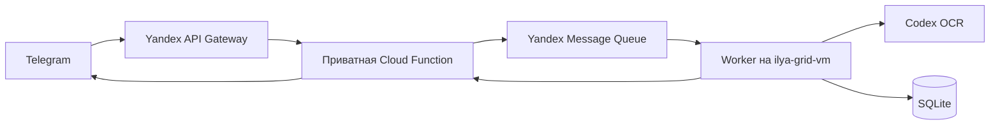

# TT Rating Bot

Бот `@tt_chatgpt_rating_bot`, группа «ТТ» (`-1004452237468`). Рейтинг за каждую
подтверждённую партию: начальный Elo 1000, K=32.

## Рабочая архитектура



Telegram доставляет updates через API Gateway; функция проверяет webhook secret
и сохраняет их в YMQ до ответа. Нажатие получает answerCallbackQuery прямо в
HTTP-ответе webhook. Worker считает голоса и обновляет то же сообщение через
приватную функцию. OCR выполняется отдельно от обработки кнопок и отправки outbox.
На VM нет Telegram-токена и прямых обращений к Telegram: весь сетевой обмен с
Telegram выполняется в облаке. Mac, локальные туннели и открытая сессия не нужны.

## Развёрнуто 2 октября 2026

- Код: `/Users/ilya-grid/tt-rating-bot`; на VM: `/opt/ttar`.
- VM: `ilya-grid-vm-59750598.klg.yp-c.yandex.net`, alias `ilya-grid-vm`, Ubuntu 24.04.
- Сервисы `ttar-worker`, `ttar-ocr`, таймер `ttar-backup` включены.
- БД: `/var/lib/ttar/history.sqlite3`; конфигурация: `/etc/ttar/config.json`.
- Backups: `/var/backups/ttar`, ежедневно 03:15 UTC (06:15 Москвы), 30 копий.
- Отдельный `ttar-ocr` авторизован через ChatGPT; Codex 0.160.0 выполняется на VM.
- Каталог `tt-rating`: `b1g5bco1nvs09aeph4sb`.
- Функция `ttar-webhook`: `d4ekmj80j8457c3lsoa1`, Python 3.12, 256 MiB,
  timeout 60 s, без prepared instances, 1 instance / 2 requests на зону.
- API Gateway `ttar-telegram` принимает webhook. Резервный минутный таймер
  `ttar-telegram-poll`: `a1s22ofbe04lc2b84336`, при webhook приостановлен.
- Очереди `ttar-updates` и `ttar-dead-letters`: 14 дней хранения.
- Два service account и Lockbox secret `ttar-webhook-secrets`.
- `tg-vk-*` не изменялись. Новая VM не создавалась.
- 76 тестов проверяют IAM JWT, облачный транспорт, webhook ACK, кнопки во время
  OCR, два разных голоса, повторы и обновление счётчика,
  ограничение методов/чата и проверку целостности фото при передаче частями.
- Реальное фото (Telegram message 16) прошло облако → очередь → worker → Codex →
  черновик №1 → облако → Telegram. Job done, outbox sent, pending Telegram 0.
  В первоначальном черновике 24 предварительные строки из двух блоков. Новые
  правила OCR учитывают порядок и словарь владельца; партии добавляются после
  двух разных подтверждений.
- Проверено отсутствие Telegram-токена в runtime credential VM; проверка прав
  администратора через приватную облачную функцию успешна. Свежий backup выполнен.
- Реальный Codex через OCR socket проверен на синтетической доске с четырьмя
  колонками: М–Р 11:5 красным, И–В 8:11 синим, М–И 21:10 зелёным.
  Три партии прочитаны верно, subtotal 3:1 исключён. Тест в рейтинг не записывался.
- Физическая проверка с выключенным Mac пока требует действия владельца.

## Сетевой фикс

При запросе из Cloud Function DNS выдал `api.telegram.org → 149.154.166.110`:
соединение закончилось TimeoutError. Та же функция через `149.154.167.220`
получила успешный getMe нового бота за 0.19 s. В истории tg-vk bridge найден
аналогичный фикс IPv4 и /etc/hosts от 6 и 26 июня.

Функция использует переменную `TG_IPV4_ADDRESS=149.154.167.220` для TCP.
Имя TLS и проверяемый сертификат остаются `api.telegram.org`: проверка TLS
не отключается. Адрес — проверенный текущий обход маршрутизации, не постоянная
гарантия Telegram. Если маршрут изменится, следует повторить безопасный probe
и обновить только эту переменную. Probe временно приостанавливает наш таймер
и заменяет latest-версию диагностикой; после него обязательно выполнить
`enable_cloud_only.py`. Для публичного webhook используется API Gateway;
прямой webhook на hostname Cloud Functions не используется. Pending updates
при переходе не удаляются.

## Доступы и обновление

Функция приватная, анонимные вызовы запрещены IAM. Producer имеет ymq.writer
в своём каталоге, доступ к payload только своего Lockbox secret и право
вызова функции. Consumer имеет ymq.reader в своём каталоге и
functions.functionInvoker только на этой функции. Временный ymq.admin удалён.

Telegram-токен хранится в Lockbox и используется только функцией. На VM ключи
queue-reader и авторизованный RSA-ключ consumer шифруются systemd-creds в
`/etc/credstore.encrypted/ttar.json`; systemd передаёт их worker через приватный
runtime-каталог. IAM-токен функция-вызова worker получает и обновляет сам.
Codex не получает этих ключей, Telegram-токена, доступа к БД и конфигурации.
Личные конфигурации yc и Codex с Mac на сервер не копируются.

Cloud adapter разрешает sendMessage, editMessageText, answerCallbackQuery, getChatMember и
скачивание фото. sendMessage/getChatMember ограничены разрешённой группой.
Фото до 20 MiB передаётся частями по 1 MiB с проверкой общей длины и SHA-256,
чтобы не превышать лимит JSON Cloud Functions 3.5 MB. Function logging выключен.

Для обновления существующей облачной схемы после синхронизации исходников и
зависимостей с VM:

```bash
cd /Users/ilya-grid/tt-rating-bot
.venv/bin/python scripts/enable_cloud_only.py
```

Скрипт проверяет нового бота и отсутствие чужого webhook, обновляет существующую
функцию, устанавливает необходимые credentials через stdin SSH. При действующем
webhook сохраняет его и оставляет резервный таймер приостановленным; иначе включает
таймер. Для первого перехода с опроса на webhook после обновления функции:

```bash
.venv/bin/python scripts/enable_gateway_webhook.py
```

Скрипт создаёт/обновляет только наш API Gateway, проверяет secret и фильтр чата,
приостанавливает наш таймер и включает webhook без удаления pending updates.
При неудаче установки пытается восстановить минутный опрос. Публичный HTTP route
принимает только Telegram updates и не открывает доступ к приватному relay.

`deploy_cloud.py` — первоначальное создание ресурсов, он блокирует
повторный переход текущей схемы к прямой связи VM с Telegram.
Метаданные — `.deploy-state.json`; приватные локальные установочные файлы —
`~/.config/ttar/` (0600), вне Git.

Оценка расходов: две сохранённые версии Lockbox дают около 40 ₽/месяц хранения,
плюс обращения к секрету и использование Functions/YMQ сверх бесплатных квот.
Для небольшой группы ориентир 40–65 ₽/месяц; согласованный ранее ориентир
бюджета 100 ₽/месяц не является автоматическим лимитом счета. Наличие и покрытие
гранта владелец проверяет в Billing: cash balance 0 ₽ не доказывает остаток гранта.
Codex использует лимиты ChatGPT; отдельный OpenAI API-ключ не подключён.

Повторный вход recognizer при необходимости:

```bash
ssh -t ilya-grid-vm "sudo -u ttar-ocr env HOME=/var/lib/ttar-ocr CODEX_HOME=/var/lib/ttar-ocr/.codex sh -c 'cd /var/lib/ttar-ocr && exec /opt/ttar/bin/codex login --device-auth'"
```

## Как пользоваться

Пришли фото. Бот перечислит только распознанные партии текстом с полными
именами; имя победителя в каждой строке подчёркнуто. Под списком есть
кнопки «Подтвердить · 0/2» и «Посчитать статистику», а также короткая подсказка.
Нужны голоса двух разных участников группы. Первый голос обновляет подпись
и кнопку до «1/2», повтор того же человека не добавляет голос. Второй голос
записывает партии и показывает «2/2». Кнопка остаётся под списком; повторные
нажатия после подтверждения не записывают партии ещё раз.
Администратор также имеет один голос. Боты и вышедшие участники голосовать
не могут; членство проверяется через облачный getChatMember. До второго
голоса история и рейтинг не меняются. Счётчик обновляется в исходном сообщении,
без отдельных сообщений на каждое нажатие. При изменении списка нужны два
новых голоса за актуальную версию. Замечания OCR не блокируют кнопку или
подтверждение: участники подтверждают именно перечисленные партии.
Подтверждение пустого списка не добавляет игры и не меняет рейтинг.

Команд всего две:

- `/confirm` — отдать голос за последний черновик группы (основной способ — кнопка).
- `/stat N` — матрица по последним N подтверждённым активным партиям всей группы.
  `/stat` использует N=1000. Можно также написать `посчитать стату 20` или `стата 20`.

Игроки: М — Максим, И — Илья, Р — Рома, В — Валя. В каждом блоке сверху
находятся 2–4 колонки игроков. Пары в строках определяются по цвету цифр,
если заполнено больше двух колонок. Одна строка может содержать две партии.
Порядок: весь левый блок сверху вниз, затем следующий справа сверху вниз;
две партии одной строки — слева направо по позиции первого участника.
Несколько блоков сами по себе не требуют ручного выбора. Итоги вроде 3:1
или 14:6, перечёркнутые и неигровые строки исключаются. Нечитаемые пары не
угадываются; замечания распознавания сохраняются в БД и не засоряют ответ.

Поддержаны партии до 11 и до 21 с преимуществом в 2 очка. Если формат не
подписан, завершённый счёт 21:x (x<=19) считается игрой до 21; продолженные
счета с разницей 2 ниже 21 считаются игрой до 11. Счёт 21:19 без подписи
формата неоднозначен между двумя форматами; для расчёта баланса принят
вариант игры до 21. На Elo это различие не влияет.

Матрица 4×4: строка — победитель, столбец — проигравший. Вне диагонали
стоят количества побед в окне N. На диагонали — сумма баллов того же окна:
победителю всегда +1, проигравшему −1 до баланса или 0 после баланса.
Баланс: 10:10 в игре до 11, 20:20 в игре до 21. Elo каждого игрока
показывается отдельно под матрицей и всегда рассчитывается по всей истории.
Таблица отправляется Telegram HTML `<pre>`, чтобы столбцы не съезжали.

Повтор фотографии не учитывается второй раз. Старый неподтверждённый
черновик при повторной отправке автоматически перераспознаётся, если
версия правил OCR обновилась. Старая кнопка подтверждения после этого
отклоняется. Уже подтверждённые фото автоматически не перераспознаются.

Команды изменения игроков, старых партий и аудит удалены из Telegram-
интерфейса. Транзакционные исправления, отмена и аудит сохранены в Store
для обслуживания на сервере; изменение подтверждённых результатов требует
действия владельца сервиса. Источник, время, raw OCR и история пересчёта
хранятся в БД, но не засоряют ответ на фото.

## Надёжность

Webhook отвечает после сохранения update в YMQ. Резервный облачный poller подтверждает пакет через Telegram offset только после сохранения всех его updates в YMQ. При сбое очереди offset не сдвигается; повтор безопасен. На VM job сначала фиксируется SQLite FULL/WAL, затем удаляется из YMQ. Очередь хранит сообщения 14 дней; poison message после 5 доставок уходит в DLQ. Worker имеет один процесс (flock), отдельные потоки приёма, OCR и обработки команд. Outbox отправляет только поток команд. Максимум 3 попытки распознавания, timeout Codex 180 s, backoff 20/40 секунд. При рестарте `processing` возвращаются в `pending`.

Отдельный Unix socket связывает worker и recognizer. Пользователи сервисов различаются, рабочая БД и ключи недоступны recognizer. shell, apps, hooks, plugins, web search, multi-agent и code mode выключены для `codex exec`; sandbox read-only, конфигурация пользователя не загружается. Неожиданный tool event отклоняет результат. Текст фотографии и любые попытки инструкций на ней рассматриваются как данные.

Одна транзакция фиксирует подтверждённые партии, Elo, audit, outbox и завершение задания. Повтор update, callback или тот же `file_unique_id`, SHA-256 байтов или SHA-256 декодированных пикселей не меняет рейтинг второй раз. Telegram `sendMessage` сам не имеет idempotency key: авария между отправкой и отметкой outbox может дать повтор ответа, но не повтор игры/Elo. Изменение PNG-метаданных или повторная упаковка одинаковых пикселей также обнаруживаются. Фото, которое заново обрезали/существенно перекодировали, может получить другой fingerprint; перед подтверждением нужно проверить повторы результатов. В коде нет автоматического суммирования разных блоков.

## Статус и журналы

```bash
ssh ilya-grid-vm 'sudo systemctl status ttar-worker ttar-ocr ttar-backup.timer --no-pager'
ssh ilya-grid-vm 'sudo journalctl -u ttar-worker -u ttar-ocr -n 100 --no-pager'
ssh ilya-grid-vm 'sudo -u ttar sh -c "cd /opt/ttar && .venv/bin/python -m ttar.admin status"'
```

Worker пишет только job ID, статус, класс ошибки, число попыток и безопасный Telegram error code. Provider stderr и Telegram API URL в журналы не попадают. Для проверки авторизации:

```bash
ssh ilya-grid-vm "sudo -u ttar-ocr env HOME=/var/lib/ttar-ocr CODEX_HOME=/var/lib/ttar-ocr/.codex sh -c 'cd /var/lib/ttar-ocr && /opt/ttar/bin/codex login status'"
```

При исчерпании лимитов подписки/ошибке авторизации фото останется в failed job без изменения Elo. После восстановления доступа повтор:

```bash
ssh ilya-grid-vm 'sudo -u ttar sh -c "cd /opt/ttar && .venv/bin/python -m ttar.admin retry UPDATE_ID"'
```

## Backup и восстановление

Ручная согласованная SQLite-копия через backup API:

```bash
ssh ilya-grid-vm 'sudo systemctl start ttar-backup.service'
ssh ilya-grid-vm 'sudo ls -lh /var/backups/ttar'
```

Скачивание копии на отдельный носитель (после данных операций Mac не нужен сервису):

```bash
ssh ilya-grid-vm 'sudo cat /var/backups/ttar/ИМЯ_КОПИИ.sqlite3' > tt-backup.sqlite3
chmod 600 tt-backup.sqlite3
```

Копии на том же диске защищают от ошибки/повреждения БД, но не от утраты VM/диска. Внешнее постоянное хранилище backup пока не подключено и не включено в согласование расходов.

Для восстановления администратор выбирает нужную копию, останавливает worker и таймер backup, сохраняет текущую БД, **включая WAL/SHM**, затем заменяет её backup и снова запускает сервис. Пример ниже выполняется вручную после выбора копии и согласования отката:

```bash
sudo systemctl stop ttar-worker.service ttar-backup.timer ttar-backup.service
ttar_restore_dir="/var/lib/ttar/rollback-$(date -u +%Y%m%dT%H%M%S%N)"
sudo install -d -m 0700 "$ttar_restore_dir"
for ttar_db_file in history.sqlite3 history.sqlite3-wal history.sqlite3-shm; do
  if sudo test -e "/var/lib/ttar/$ttar_db_file"; then
    sudo mv "/var/lib/ttar/$ttar_db_file" "$ttar_restore_dir/"
  fi
done
sudo install -o ttar -g ttar -m 0600 /var/backups/ttar/ИМЯ_КОПИИ.sqlite3 /var/lib/ttar/history.sqlite3
sudo -u ttar /opt/ttar/.venv/bin/python -c 'import sqlite3; c=sqlite3.connect("/var/lib/ttar/history.sqlite3"); print(c.execute("PRAGMA integrity_check").fetchone()[0])'
sudo systemctl start ttar-worker.service ttar-backup.timer
```

Откат к старому backup может восстановить pending outbox и потерять уже принятые после backup updates, удалённые из YMQ. Перед возвратом в работу сверить журнал и сообщения Telegram; не подтверждать повторно старые игры вслепую.

## Проверки до приёмки

```bash
cd /Users/ilya-grid/tt-rating-bot
.venv/bin/python -m pytest -q
```

Нужно дополнительно:

1. Проверить работу `ttar-ocr` через его Unix socket под systemd после отдельного входа.
2. Согласовать и развернуть облако, проверить неправильный secret (403), чужой чат (ignored), доступ основной очереди с VM, metadata webhook.
3. Отправить новую реальную фотографию в TT, получить черновик, проверить партии и явно подтвердить. Тестовые результаты не подтверждать в production.
4. Повторно отправить ту же фотографию и нажать подтверждение повторно: счётчик игр и Elo должны остаться прежними.
5. Закрыть локальную SSH/Codex-сессию, выключить Mac и отправить ещё одну фотографию: черновик должен появиться автоматически. Этот acceptance test пока не выполнен.

## Официальные источники

- [Codex authentication](https://learn.chatgpt.com/docs/auth)
- [Codex non-interactive mode / structured output](https://learn.chatgpt.com/docs/non-interactive-mode)
- [Codex CLI commands / image input](https://learn.chatgpt.com/docs/developer-commands?surface=cli)
- [Telegram Bot API](https://core.telegram.org/bots/api)
- [Cloud Functions pricing](https://yandex.cloud/ru/docs/functions/pricing)
- [Message Queue pricing](https://yandex.cloud/en/docs/message-queue/pricing)
- [YMQ access roles](https://yandex.cloud/ru/docs/message-queue/security/)
- [Lockbox pricing](https://yandex.cloud/ru/docs/lockbox/pricing)
- [Lockbox secrets in Functions](https://yandex.cloud/en/docs/functions/operations/function/lockbox-secret-transmit)
