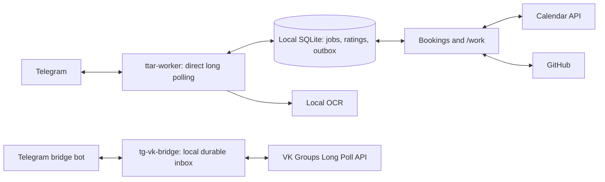

# Direct host deployment

Current host: `ilya-grid-vm`. Production transport configuration is
`telegram_transport: direct` in `/etc/ttar/config.json`.

The tennis worker uses the normal Telegram hostname and IPv6. Do not copy the
old cloud-only hardcoded IPv4 override. Both input and output persist locally;
Telegram offsets advance only after the whole incoming batch commits to SQLite.
Two-person confirmations, OCR, history, booking policy and owner permissions are
unchanged. Tests cover redelivery and restart deduplication.

The bridge source is in `bridge/`, deployed separately to `/opt/tg-vk-bridge`.
It retains photo, video, reply and reaction handling. `tg-vk-bridge.service`
uses `/etc/tg-vk-bridge.env`, readable only by root, and a dedicated service user.
Reply mappings, event deduplication and both upstream cursors are in
`/var/lib/tg-vk-bridge/history.sqlite3`. The Telegram user-session fallback for
large videos is retained in the same private directory and uses IPv6.
VK callback delivery must be disabled while Groups Long Poll is active.

The controller reads the runtime transport before deploying. Direct mode does
not request Cloud IAM, function metadata, or deploy cloud versions. Install the
controller with `scripts/install_maintenance.py --direct`; only the Calendar
credential is needed. The ordinary `/work` deployment updates tennis code;
bridge changes require deploying its separate service as well.

Migration backups (credentials included; never print or commit contents) are in
`/var/lib/ttar-migration-20261010`, owned by root with mode 0700. They include
the original bridge files, VK settings, original tennis configuration and cloud
credentials. SQLite backups preserve games independently of transport changes.

For rollback before cloud resources are retired: stop the local bridge and the
direct worker, restore the saved worker config/credential and VK callback
settings, disable VK long polling, then restart the original cloud pollers.
Never run two getUpdates consumers for the same bot. Import any newly processed
bridge mapping before rollback; never restore an old tennis database over new votes.

Read-only identity, member checks and photo downloads do not validate delivery.
Migration acceptance also requires real send/receive checks and a restart check.
